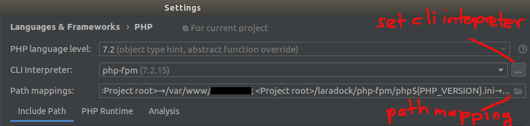
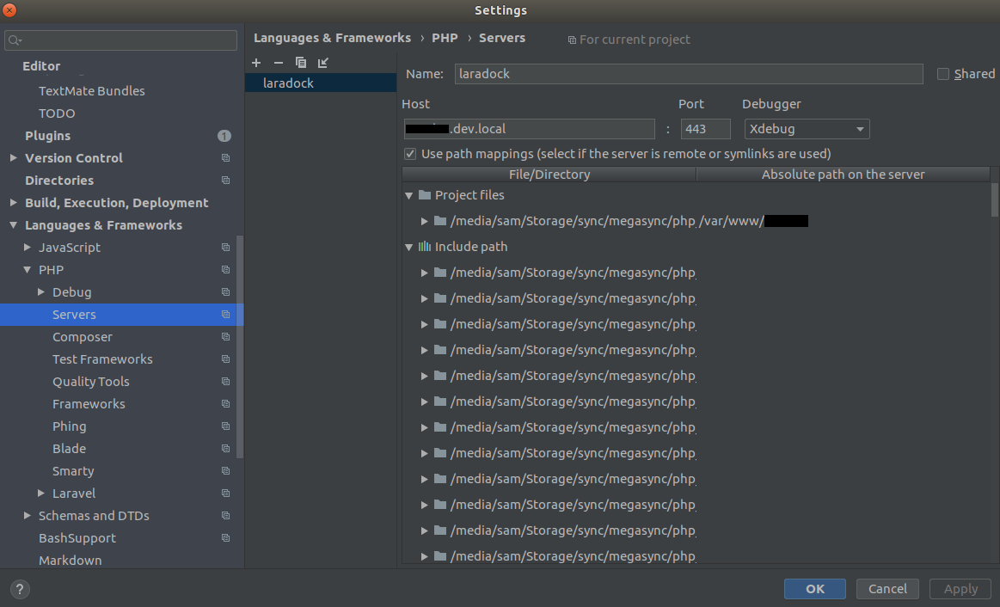

# Setup with LaraDock (Laravel & Docker)

### Step 1: Install Laradock and config
Laradock is the docker version of Laravel homestead. Unlike homestead, it is highly scalable and production-ready. Go to https://laradock.io/ and check out their wonderful quick start guide. Download a copy of https://github.com/laradock/laradock and place it in your project folder

- In this project, i have already added (git submodule) laradock, so just create new file and config as below:

```
# File path: ./laradock-tntt/nginx/sites/laravel.conf

server {

    listen 80;
    listen [::]:80;

    server_name laravel.test;
    root /var/www/laravel/public;
    index index.php index.html index.htm;

    location / {
         try_files $uri $uri/ /index.php$is_args$args;
    }

    location ~ \.php$ {
        try_files $uri /index.php =404;
        fastcgi_pass php-upstream;
        fastcgi_index index.php;
        fastcgi_buffers 16 16k;
        fastcgi_buffer_size 32k;
        fastcgi_param SCRIPT_FILENAME $document_root$fastcgi_script_name;
        #fixes timeouts
        fastcgi_read_timeout 600;
        include fastcgi_params;
    }

    location ~ /\.ht {
        deny all;
    }

    location /.well-known/acme-challenge/ {
        root /var/www/letsencrypt/;
        log_not_found off;
    }

    error_log /var/log/nginx/app_error.log;
    access_log /var/log/nginx/app_access.log;
} 
```

#### Config laravel environment

```
# File path: laradock-tntt/.env
 Set APP_CODE_PATH_CONTAINER

# Rename COMPOSE_PROJECT_NAME to your project name.
# Under php-fpm:
  Set PHP_FPM_INSTALL_XDEBUG=true
    
# Under MySQL
  Change MYSQL_VERSION from “latest” to 5.7.25. This is a workaround for a bug in MySQL v8
  Change MYSQL_PORT if you have a local MySQL server installed already

# Under workspace
  Set WORKSPACE_INSTALL_PYTHON=true
  Set WORKSPACE_INSTALL_WORKSPACE_SSH=true
```

### Step 2: Config PHPStorm
Build the images and start the containers before continuing. Run the following command in the `laradock-tntt` folder under your project directory.

```bash
$ docker-compose build nginx php-fpm mysql 
# nginx is dependent on php-fpm, starting nginx will automatically start php-fpm
$ docker-compose up -d nginx mysql

# to view all started container
$ docker-compose ps

# you can ssh into your workspace container by running:
$ docker-compose exec workspace bash
```

In PHPStorm , go to settings > Languages & Frameworks > PHP Configure the CLI Interpreter


Remember to configure your project root path mapping as well,



Add a new server named ‘laradock’



### Start coding!
In your laradock folder, run:

```bash
# start the containers
docker-compose up -d nginx mysql

# ssh into the workspace container
docker-compose exec workspace bash
```

### References 

 - [Docker + Vue Hot Reload + Laravel + XDebug + PhpStorm= ❤️](https://medium.com/@sam_ngu/docker-phpstorm-laravel-xdebug-vue-hot-reload-%EF%B8%8F-c561187e1bb9)
